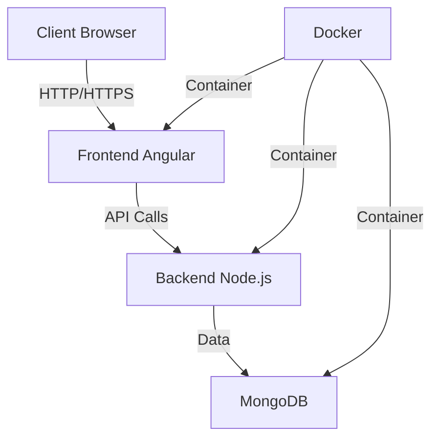
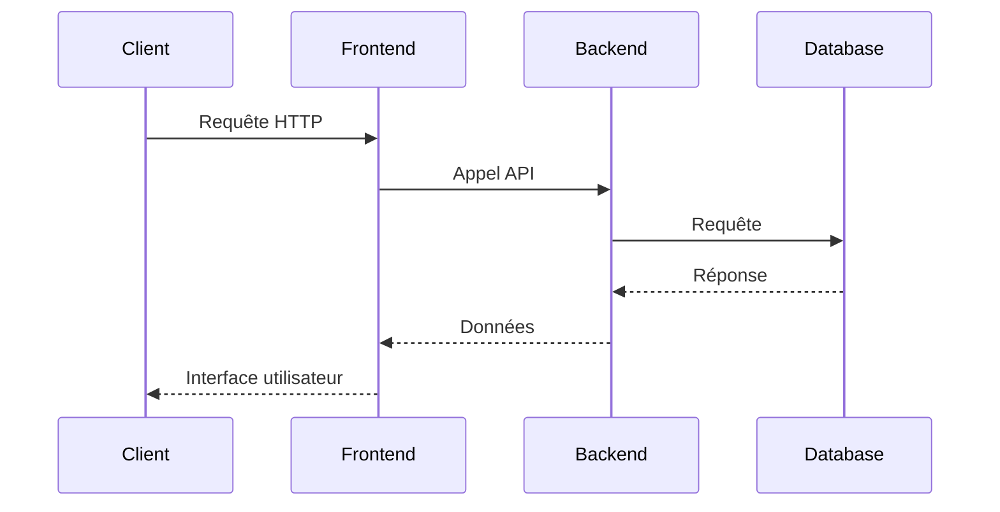

# Wiki du Projet Starter Kit Monorepo

## Table des matières

1. [Vue d'ensemble](#vue-densemble)
2. [Architecture](#architecture)
3. [Technologies utilisées](#technologies-utilisées)
4. [Installation et déploiement](#installation-et-déploiement)
5. [Guide de développement](#guide-de-développement)
6. [Documentation API](#documentation-api)
7. [Tests](#tests)
8. [Déploiement en production](#déploiement-en-production)

## Vue d'ensemble

Ce projet est un starter kit monorepo moderne qui combine une application frontend Angular 18 avec une API backend Node.js, le tout orchestré avec Docker. Il est conçu pour offrir une base solide pour le développement d'applications web modernes avec une architecture microservices.

### Fonctionnalités principales

- Architecture monorepo avec séparation claire frontend/backend
- Conteneurisation avec Docker
- API REST documentée avec Swagger
- Validation des schémas avec @ts-rest
- Hot-reload pour le développement
- Tests automatisés
- Structure modulaire et évolutive

## Architecture

### Structure du projet

```
.
├── frontend/          # Application Angular
│   ├── src/          # Code source Angular
│   ├── Dockerfile    # Configuration Docker frontend
│   └── ...
├── backend/          # API Node.js
│   ├── src/          # Code source Node.js
│   ├── Dockerfile    # Configuration Docker backend
│   └── ...
├── docker-compose.yml # Orchestration des services
└── README.md
```

### Diagramme d'architecture



### Flux de données



## Technologies utilisées

### Frontend

- **Framework**: Angular 18
- **Langage**: TypeScript
- **État**: NgRx (si utilisé)
- **Tests**: Jest
- **Validation**: @ts-rest
- **UI Components**: Angular Material
- **Routing**: Angular Router
- **HTTP Client**: Angular HttpClient

### Backend

- **Runtime**: Node.js
- **Framework**: Express.js
- **Langage**: TypeScript
- **Base de données**: MongoDB
- **ORM**: Mongoose
- **Validation**: @ts-rest
- **Documentation**: Swagger
- **Tests**: Jest

### DevOps

- **Conteneurisation**: Docker
- **Orchestration**: Docker Compose
- **CI/CD**: GitHub Actions (configurable)
- **Environnement**: Node.js 20.x

## Installation et déploiement

### Prérequis

- Docker
- Docker Compose
- Node.js 20.x (pour le développement local)
- Git

### Installation locale

1. Cloner le repository

```bash
git clone [URL_DU_REPO]
cd [NOM_DU_PROJET]
```

2. Configuration des variables d'environnement

```bash
# Frontend (.env)
cp frontend/.env.example frontend/.env

# Backend (.env)
cp backend/.env.example backend/.env
```

3. Démarrer avec Docker

```bash
docker-compose up --build
```

Les services seront accessibles sur :

- Frontend: http://localhost:4200
- Backend: http://localhost:3000
- MongoDB: mongodb://localhost:27017
- Documentation API: http://localhost:3000/api/docs

### Installation pour le développement

1. Installation des dépendances frontend

```bash
cd frontend
npm install
```

2. Installation des dépendances backend

```bash
cd backend
npm install
```

3. Démarrer les services en mode développement

```bash
# Terminal 1 - Frontend
cd frontend
npm start

# Terminal 2 - Backend
cd backend
npm run dev
```

## Guide de développement

### Structure du code frontend

```
frontend/
├── src/
│   ├── app/
│   │   ├── core/           # Services singleton, modèles, etc.
│   │   ├── features/       # Modules fonctionnels
│   │   ├── shared/         # Composants, directives, pipes partagés
│   │   └── store/          # État global (NgRx)
│   ├── assets/            # Ressources statiques
│   └── environments/      # Configuration par environnement
```

### Structure du code backend

```
backend/
├── src/
│   ├── controllers/      # Gestionnaires de requêtes
│   ├── models/          # Modèles Mongoose
│   ├── routes/          # Définition des routes
│   ├── services/        # Logique métier
│   └── utils/           # Utilitaires
```

### Bonnes pratiques

- Suivre les conventions de nommage Angular
- Utiliser les types TypeScript
- Documenter le code
- Écrire des tests unitaires
- Utiliser les linters (ESLint, Prettier)

## Documentation API

La documentation de l'API est générée automatiquement avec Swagger et est accessible à :
http://localhost:3000/api/docs

### Points d'entrée principaux

- `/api/v1/*` - API REST
- `/api/docs` - Documentation Swagger
- `/api/health` - Endpoint de santé

## Tests

### Frontend

```bash
cd frontend
npm run test
```

### Backend

```bash
cd backend
npm run test
```

## Déploiement en production

### Préparation

1. Mettre à jour les variables d'environnement
2. Construire les images Docker
3. Configurer le reverse proxy (Nginx recommandé)

### Étapes de déploiement

1. Construire les images

```bash
docker-compose -f docker-compose.prod.yml build
```

2. Déployer les containers

```bash
docker-compose -f docker-compose.prod.yml up -d
```

### Configuration du serveur de production

- Utiliser un reverse proxy (Nginx)
- Configurer SSL/TLS
- Mettre en place un monitoring
- Configurer les sauvegardes de la base de données

### Exemple de configuration Nginx

```nginx
server {
    listen 80;
    server_name votre-domaine.com;

    location / {
        proxy_pass http://localhost:4200;
        proxy_set_header Host $host;
        proxy_set_header X-Real-IP $remote_addr;
    }

    location /api {
        proxy_pass http://localhost:3000;
        proxy_set_header Host $host;
        proxy_set_header X-Real-IP $remote_addr;
    }
}
```

### Maintenance

- Mettre en place des sauvegardes automatiques
- Configurer des alertes de monitoring
- Planifier les mises à jour de sécurité
- Documenter les procédures de rollback
